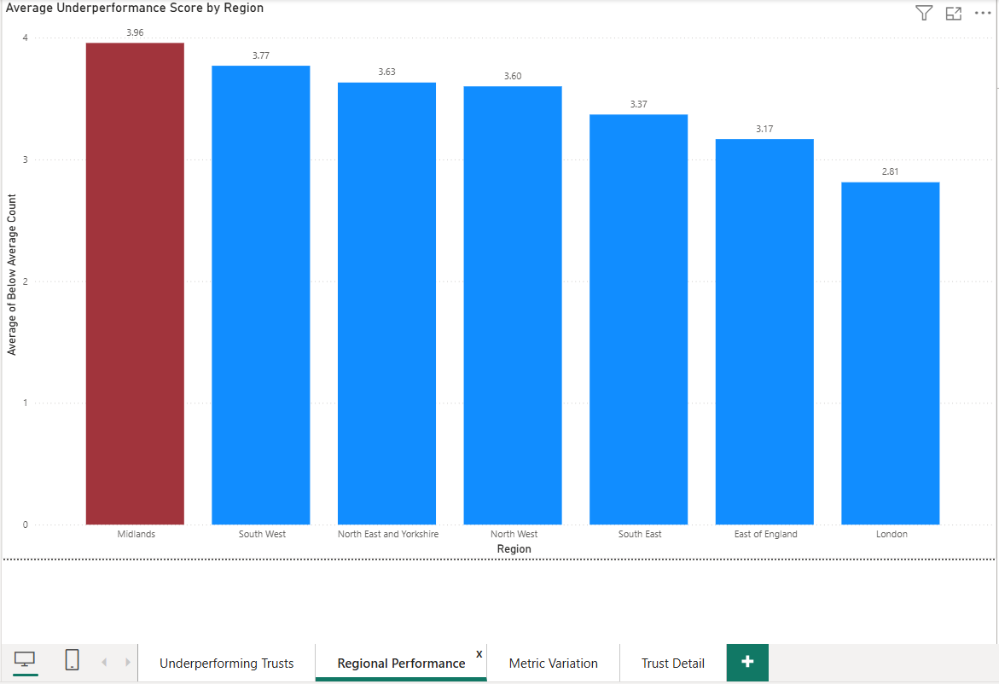
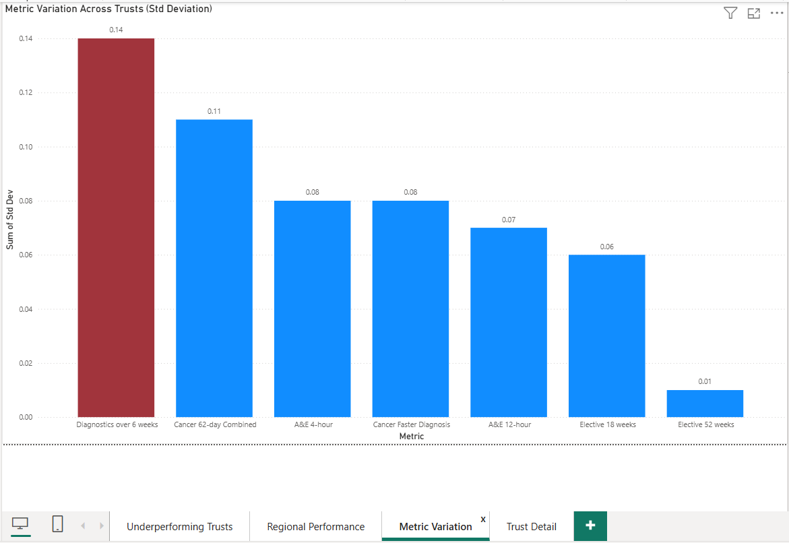

# NHS Acute Trust Performance Data Audit

Analysis of performance data across 134 NHS acute trusts, with a focus on
data quality issues affecting reliability of published figures.

## The question
An independent data quality audit of NHS acute trust performance data across 134 trusts. The goal was to establish whether the dataset was reliable enough to draw meaningful conclusions from before conducting any analysis. Key findings included specialist trusts reporting N/R for metrics that did not apply to them, high variation in Diagnostics over 6 weeks flagged as a likely data collection inconsistency rather than a genuine performance difference, and four trusts consistently below average across six of seven metrics. Documented in a 22-entry audit log and visualised in a four-page Power BI dashboard.

## Data
**Source:** [model.nhs.uk/acute-provider-performance], covering January-February 2026. [134 rows]
**Key fields:**
| Field | Period | Notes |
|---|---|---|
| Trust Code | — | Source |
| Trust Name | — | Source |
| Region | — | Added via INDEX/MATCH enrichment |
| Trust Type | — | General Acute or Specialist, derived during cleaning |
| RTT within 18 weeks (%) | Jan 2026 | Source |
| RTT over 52 weeks (%) | Jan 2026 | Source |
| Cancer Faster Diagnosis Standard | Jan 2026 | Source |
| Cancer 62-day combined performance | Jan 2026 | Source |
| Diagnostics waiting over 6 weeks (%) | Jan 2026 | Source |
| A&E 4-hour performance | Feb 2026 | Source |
| A&E 12-hour performance | Feb 2026 | Provisional |
| Below Average Count | — | Calculated during analysis |

## Approach
Cleaned and profiled in Excel, modelled and visualised in Power BI.
Full audit log of issues found: [audit-log.md](audit-log.md)
This is a working log kept during the audit rather than a summary
written afterwards. Entries record what was known at the time, so
some remain open where a later finding resolved them. Cross-references
point to the entry that clarifies each one.

## Dashboard

[Average Underperformance Score by Region]

[Metric Variation Across Trusts (Std Deviation)]
